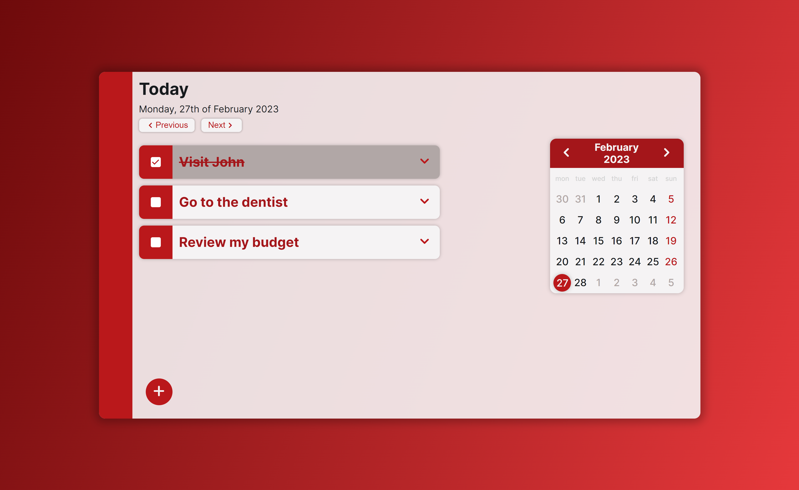
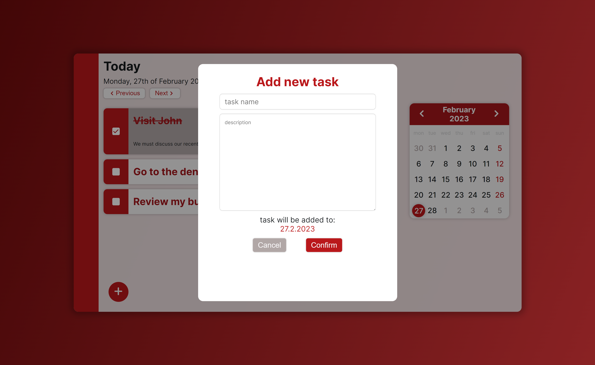
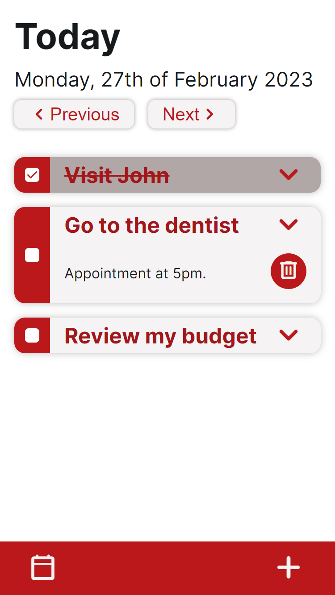

### To-do App
It's a basic JavaScript app, which I made to reinforce my skills.
It supports task lists for diffrent days that user can select. Just what you expect from a to-do app. 
I've made the app responsive, so it changes the graphical layout for different sizes of screen.

### Screenshots

### How to run it?
Run the `npm install` and `npm run start` commands in the project directory to check it out.